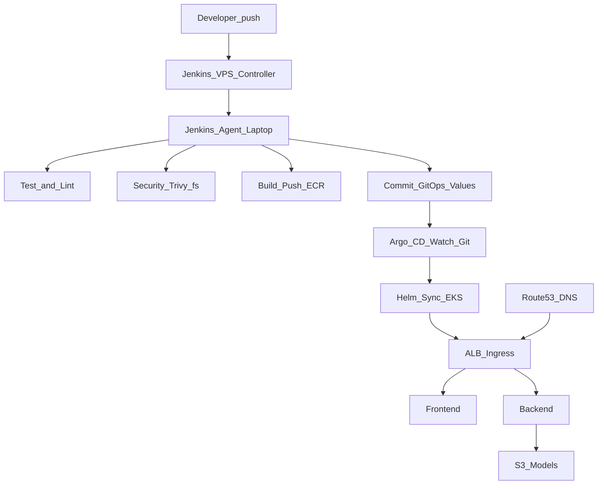

# AI Image Caption Platform

AI-powered image captioning on AWS EKS — MVP DevOps/MLOps platform demonstrating Terraform automation, Jenkins CI/CD, Kubernetes deployments, ML inference workload, monitoring, and logging.

**Repository layout** (aligned with a typical `platform/` product tree, at repo root): **`applications/`** (api + web), **`deploy/`** (`helm/`, `kubernetes/`, `argocd/`), **`infrastructure/`** (`terraform/`, `scripts/`), **`observability/`** (Prometheus / Loki / Grafana placeholders), **`models/`** (weights, gitignored), **`ci/jenkins/`**, **`docs/`**.

## Architecture

```
User -> Route53 (minhhuy.me) -> ALB (HTTPS) -> EKS -> Services
```

| Subdomain | Target |
|-----------|--------|
| `app.minhhuy.me` | React frontend |
| `api.minhhuy.me` | FastAPI backend |
| `grafana.minhhuy.me` | Grafana dashboards |
| `jenkins.minhhuy.me` | Jenkins VPS |

Jenkins runs **on a VPS** (controller); the **laptop SSH agent** runs **CI** (test, security scan, build/push ECR, commit GitOps manifests). **Argo CD** on the cluster performs **CD** by syncing Helm from Git.

Terraform state is stored remotely on **S3 + DynamoDB lock**; infra changes are planned in Jenkins (GitOps-light) with optional manual apply.

### EKS services (Helm)

| Service | Chart | Namespace |
|---------|-------|-----------|
| Backend (FastAPI caption inference) | local [`deploy/helm/demo-app`](deploy/helm/demo-app) | default |
| Frontend (React + nginx) | local [`deploy/helm/demo-app`](deploy/helm/demo-app) | default |
| Prometheus + Grafana | kube-prometheus-stack | monitoring |
| Loki + Promtail | grafana/loki-stack | logging |
| ALB Controller | eks/aws-load-balancer-controller | kube-system |

#### Loki — how logs reach Grafana

- **Loki + Promtail** ([`observability/loki/values.yaml`](observability/loki/values.yaml)): Promtail ships **container logs** to Loki. Grafana (kube-prometheus-stack) gets a **Loki datasource** from [`observability/prometheus/values.yaml`](observability/prometheus/values.yaml) (`http://loki.logging.svc.cluster.local:3100`). Use Grafana → **Explore** → datasource **Loki** to query pod logs. The FastAPI app does not call Loki from Python; logging is at the cluster level.

## Tech Stack

- **Cloud**: AWS (EKS, VPC, ALB, ECR, S3 models bucket, Route53, ACM, IRSA)
- **IaC**: Terraform (community modules, S3 remote state)
- **Orchestration**: Kubernetes (Helm charts)
- **CI/CD**: Jenkins (**CI**) + Argo CD (**CD**, GitOps)
- **Monitoring**: Prometheus + Grafana
- **Logging**: Loki + Promtail (viewable in Grafana)
- **Frontend**: React + Vite + TypeScript
- **Backend**: FastAPI + TensorFlow/Keras caption model + Transformers ViT encoder

## Deployment Flow (End-to-End)



## Prerequisites

- AWS CLI configured with appropriate credentials
- Terraform >= 1.5
- kubectl, eksctl, Helm 3
- Node.js >= 20 (frontend builds)
- VPS with Docker (Jenkins controller)
- Laptop with Docker + AWS CLI + kubectl + Helm + Terraform (Jenkins agent)

## Quick Start

```bash
# 0. One-time: S3 bucket + DynamoDB lock table + infrastructure/terraform/backend.hcl
./infrastructure/scripts/00-bootstrap-tf-backend.sh

# 1. Jenkins job: infra-pipeline (Script Path = ci/jenkins/Jenkinsfile.infra)
#    - STAGE=plan  (default) — review output
#    - STAGE=apply — provisions EKS, ECR, S3, ACM, Route53

# 2. Jenkins job: cluster-bootstrap (Script Path = ci/jenkins/Jenkinsfile.bootstrap)
#    - Run once after infra-pipeline apply
#    - Installs ALB controller, Prometheus+Grafana, Loki, Argo CD, applies Argo Applications

# 3. (On VPS) Jenkins controller
./infrastructure/scripts/06-setup-jenkins-vps.sh

# 4. (On laptop) Agent tools (kubectl, helm, eksctl, argocd CLI)
./infrastructure/scripts/07-setup-jenkins-agent.sh

# 5. Put model files under models/, then upload to S3 (required for inference)
./infrastructure/scripts/08-upload-models.sh

# 6. Jenkins job: app-ci-pipeline (Script Path = ci/jenkins/Jenkinsfile.app)
#    - Runs automatically on every push (pollSCM)
#    - test → build → push ECR → git commit manifest → Argo CD syncs

# 7. (Optional) Jenkins job: gitops-sync-check (Script Path = ci/jenkins/Jenkinsfile.synccheck)
#    - Verify Argo CD sync + rollout health + smoke test /health
```

### Recreating AWS from scratch (after `terraform destroy`)

Everything in steps **3–10** needs a **running EKS cluster** and working `kubectl`. If AWS was destroyed, `kubectl` / Helm will fail with DNS or “cluster unreachable” until you apply again.

**Recommended order:**

1. **Repo only (no AWS):** In [`deploy/argocd/applications/`](deploy/argocd/applications/), set `repoURL` / `targetRevision` to the Git repo Argo will read (fork or default). Configure Jenkins credentials `aws-creds-id` and `gitops-git-pat` on the controller.
2. **Terraform:** `./infrastructure/scripts/00-bootstrap-tf-backend.sh` once (if new account/region), then Infra job or `terraform apply` until EKS, ECR, S3, Route53, ACM exist.
3. **Cluster access:** `./infrastructure/scripts/02-configure-kubectl.sh` — confirm `kubectl get nodes`.
4. **In-cluster stack:** Run **`cluster-bootstrap`** job (`ci/jenkins/Jenkinsfile.bootstrap`) — or manually: `03-install-alb.sh` → `04-deploy-services.sh` → `05-verify.sh`.
5. **Jenkins / agent:** `./infrastructure/scripts/06-setup-jenkins-vps.sh`, `./infrastructure/scripts/07-setup-jenkins-agent.sh` (machines can be prepared anytime).
6. **Models:** `./infrastructure/scripts/08-upload-models.sh`.
7. **GitOps CD:** `./infrastructure/scripts/09-install-argocd.sh` → `kubectl apply -f deploy/argocd/applications/`.
8. **CI → CD:** Run **`app-ci-pipeline`** — it will test, build, push to ECR, commit updated manifests, and push to Git. Argo CD picks up the push and syncs automatically.

Optional: remove stale kubeconfig contexts after destroy: `kubectl config get-contexts` then `kubectl config delete-context …`.

### Domain setup (one-time)

After `terraform apply` outputs `route53_nameservers`, update your Namecheap DNS to use those nameservers. ACM wildcard certificate for `*.minhhuy.me` will auto-validate via DNS.

## Jenkins Pipelines

Four separate jobs, each with a single responsibility. In Jenkins: **New Item → Pipeline**, set Script Path per table below.

Step definitions are YAML files under [`ci/jenkins/stages/`](ci/jenkins/stages/), grouped by job: **`infra/`**, **`build_sw/`** (app CI: test, build, GitOps), **`bootstrap/`**, **`synccheck/`** (each Jenkinsfile sets `stagesDir` to the matching folder).

| Job name | Script Path | When to run | Trigger |
|----------|-------------|-------------|---------|
| `infra-pipeline` | [`ci/jenkins/Jenkinsfile.infra`](ci/jenkins/Jenkinsfile.infra) | Provision / change / destroy AWS infra (EKS, ECR, S3, ACM…) | Manual |
| `cluster-bootstrap` | [`ci/jenkins/Jenkinsfile.bootstrap`](ci/jenkins/Jenkinsfile.bootstrap) | One-time platform setup after EKS is ready (ALB, monitoring, logging, Argo CD) | Manual |
| `app-ci-pipeline` | [`ci/jenkins/Jenkinsfile.app`](ci/jenkins/Jenkinsfile.app) | Every code push: test → build → push ECR → GitOps commit | `pollSCM` / webhook |
| `gitops-sync-check` | [`ci/jenkins/Jenkinsfile.synccheck`](ci/jenkins/Jenkinsfile.synccheck) | Verify Argo CD sync, rollout health, and API smoke test | Downstream of `app-ci-pipeline` or manual |

### 1. infra-pipeline (`STAGE` parameter)

- `plan` (default): `tf-init` → **`tf-fmt`** → **`tf-validate`** → `tf-plan` (archives tfplan). Console prints ACM ARN from state.
- `apply`: `tf-init` → `tf-apply`. Prints banner with `acm_certificate_arn` after apply.
- `plan-then-apply`: `tf-init` → `tf-fmt` → `tf-validate` → `tf-plan` → `tf-apply`
- `destroy`: `tf-init` → `tf-destroy`

### 2. cluster-bootstrap

No parameters — fixed sequence (requires EKS to exist from `infra-pipeline apply`):

`configure-kubectl` → `install-alb` → `install-monitoring` → `install-logging` → `install-argocd` → `verify-cluster`

Run once after first `infra-pipeline apply`; re-run anytime to reinstall individual components.

### 3. app-ci-pipeline

Pure CI — no cluster access, runs on every push:

`checkout` → `backend-test` → `frontend-build` → `security-scan` → `docker-build-push` → `update-gitops`

- `backend-test`: `pytest` for `applications/api`
- `frontend-build`: `npm install && npm run build` for `applications/web`
- `security-scan`: **Trivy** fs scan HIGH/CRITICAL (`--exit-code 0` for MVP)
- `docker-build-push`: Docker build + ECR push for backend and frontend (`BUILD_NUMBER` tag)
- `update-gitops`: reads Terraform outputs, renders [`deploy/helm/demo-app/values-argocd.yaml`](deploy/helm/demo-app/values-argocd.yaml) + Grafana ingress, **git commit + push** → triggers Argo CD sync

### 4. gitops-sync-check

`argocd-app-status` → `kubectl-rollout` → `smoke-test`

- `argocd-app-status`: `argocd app wait --health --sync --timeout 120`
- `kubectl-rollout`: `kubectl rollout status` for backend + frontend deployments
- `smoke-test`: resolves ALB hostname from ingress, retries `GET /health` up to 5 times

### Jenkins credentials

| ID | Type | Used by |
|----|------|---------|
| `aws-creds-id` | AWS Credentials | all four pipelines |
| `gitops-git-pat` | Username + password | `app-ci-pipeline` (`update-gitops` stage only) |
| `argocd-creds` | Username + password | `gitops-sync-check` (username = ArgoCD server URL, password = auth token) |

Notes:
- `ECR_REGISTRY` is computed automatically from AWS account id + region — no separate secret needed.
- `git push` in `update-gitops` requires `origin` to use an **HTTPS** URL.
- After the first successful `update-gitops` commit, Argo CD syncs [`deploy/helm/demo-app`](deploy/helm/demo-app) using `values.yaml` + `values-argocd.yaml`.
- Agent prep: [`infrastructure/scripts/07-setup-jenkins-agent.sh`](infrastructure/scripts/07-setup-jenkins-agent.sh) installs kubectl, helm, eksctl, argocd CLI.
- Model upload ([`infrastructure/scripts/08-upload-models.sh`](infrastructure/scripts/08-upload-models.sh)) stays manual — run after S3 bucket exists.
## Argo CD (CD)<!--  -->

- **Install**: [`infrastructure/scripts/09-install-argocd.sh`](infrastructure/scripts/09-install-argocd.sh) installs the upstream **Argo CD** Helm chart into namespace `argocd`.
- **Applications**: apply manifests under [`deploy/argocd/applications/`](deploy/argocd/applications/) (edit `repoURL` / `targetRevision` if you fork or use a release branch).
- **Demo app**: Helm source path `deploy/helm/demo-app` with `values.yaml` + `values-argocd.yaml`.
- **Grafana ingress**: separate Application pointing at [`deploy/argocd/manifests/grafana`](deploy/argocd/manifests/grafana) (Kustomize), same ALB group annotation as the app chart.

More detail: [`deploy/argocd/README.md`](deploy/argocd/README.md).

## Application

### Backend (`applications/api/`)

FastAPI app serving a ViT image-captioning model.

Endpoints:
- `POST /predict`: upload image, returns caption
- `GET /health`: health check
- `GET /metrics`: Prometheus metrics

Model loading:
- `initContainer` copies `patched_models/` from S3 into `/models` via IRSA.
- If S3 prefix is empty, inference will fail with `Missing model file: /models/...`.

### Frontend (`applications/web/`)

React + Vite SPA with image upload, preview, and caption display.

API base URL selection:
- If `VITE_API_URL` is set, it will be used.
- Otherwise, the UI auto-maps `app.<domain>` -> `api.<domain>` (so `app.minhhuy.me` calls `api.minhhuy.me`).

### Run locally

```bash
# Backend
cd applications/api
python3 -m venv .venv && source .venv/bin/activate
pip install -r requirements.txt
uvicorn api:app --host 0.0.0.0 --port 8000

# Frontend (separate terminal)
cd applications/web
npm install
VITE_API_URL=http://localhost:8000 npm run dev
```

## Observability

### Metrics (Prometheus + Grafana)

- Backend exposes `/metrics` (Prometheus)
- Grafana access: `grafana.minhhuy.me` (admin / admin123)

### Logs (Loki + Promtail + Grafana)

- Promtail ships pod logs to Loki
- Grafana has Loki datasource configured
- Example query: `{app="demo-app-backend"}`

## Operations & Troubleshooting

### Inference returns 500: `Missing model file: /models/...`
This means S3 `patched_models/` is empty or not synced to the pod.

1) Get the bucket name:
```bash
cd infrastructure/terraform
terraform output -raw models_bucket
```

2) Confirm objects exist:
```bash
aws s3 ls "s3://<bucket>/patched_models/"
```

3) Upload models (one-time / when updated):
```bash
./infrastructure/scripts/08-upload-models.sh
```

4) Restart backend to re-run initContainer:
```bash
kubectl rollout restart deploy/demo-app-backend -n default
kubectl rollout status deploy/demo-app-backend -n default --timeout=10m
kubectl logs -n default deploy/demo-app-backend -c fetch-models --tail=100
```

### Docker build fails on `/media/...` (fuseblk) with `invalid argument`
If Jenkins workspace is on `/media/...` (fuseblk/NTFS), Docker layers may fail due to filenames containing `:` (dpkg files like `gcc-*-base:amd64.list`).

Fix:
- Run Jenkins workspace on an **ext4** path (recommended), or mount an **ext4 loopback** image and use it as workspace.

### Browser shows CORS errors
Backend enables CORS. If browser reports `CORS missing allow origin`, verify the request URL is `https://api.minhhuy.me/...` and test with:

```bash
curl -i -H "Origin: https://app.minhhuy.me" https://api.minhhuy.me/health
curl -i -X OPTIONS \
  -H "Origin: https://app.minhhuy.me" \
  -H "Access-Control-Request-Method: POST" \
  -H "Access-Control-Request-Headers: content-type" \
  https://api.minhhuy.me/predict
```

## Project Structure

```
├── applications/
│   ├── api/                 # FastAPI + Dockerfile + tests
│   └── web/                 # React + Vite + Dockerfile
├── deploy/
│   ├── helm/demo-app/       # Application Helm chart (+ values-argocd for GitOps)
│   ├── kubernetes/        # Namespaces, ALB values ref, legacy Grafana ingress YAML
│   └── argocd/              # Argo CD Applications + Grafana Kustomize
├── infrastructure/
│   ├── terraform/           # VPC, EKS, ECR, S3, IRSA, Route53, ACM
│   └── scripts/             # 00-bootstrap … 09-install-argocd
├── observability/
│   ├── prometheus/          # kube-prometheus-stack values
│   ├── loki/                # loki-stack values
│   └── grafana/             # placeholder (Grafana via prometheus chart)
├── models/                  # Weights (gitignored); runtime reads via MODELS_DIR default
├── ci/jenkins/              # Jenkinsfile.* + stages/{infra,build_sw,bootstrap,synccheck}/*.yaml
└── docs/                    # Doc index → root README
```

## Environment

- **Single environment**: dev only
- **Naming convention**: `image-caption-dev-*`
- **Region**: `ap-southeast-1`
