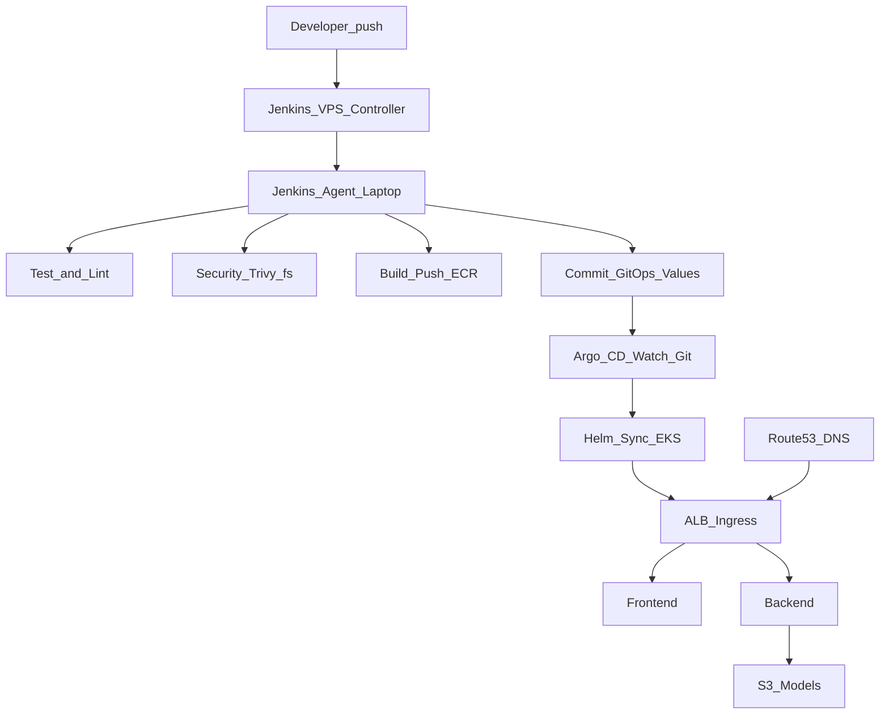

# AI Image Caption Platform

AI-powered image captioning on AWS EKS — MVP DevOps/MLOps platform demonstrating Terraform automation, Jenkins CI/CD, Kubernetes deployments, ML inference workload, monitoring, and logging.

**Repository layout (product-style monorepo):** `backend/` + `frontend/` (services), `infra/` (Terraform + platform Helm values + raw K8s), `deploy/` (application Helm chart + Argo GitOps), `ci/jenkins/` (pipelines), `scripts/` (operator automation).

## Architecture

```
User -> Route53 (minhhuy.me) -> ALB (HTTPS) -> EKS -> Services
```

| Subdomain | Target |
|-----------|--------|
| `app.minhhuy.me` | React frontend |
| `api.minhhuy.me` | FastAPI backend |
| `grafana.minhhuy.me` | Grafana dashboards |
| `jenkins.minhhuy.me` | Jenkins VPS |

Jenkins runs **on a VPS** (controller); the **laptop SSH agent** runs **CI** (test, security scan, build/push ECR, commit GitOps manifests). **Argo CD** on the cluster performs **CD** by syncing Helm from Git.

Terraform state is stored remotely on **S3 + DynamoDB lock**; infra changes are planned in Jenkins (GitOps-light) with optional manual apply.

### EKS services (Helm)

| Service | Chart | Namespace |
|---------|-------|-----------|
| Backend (FastAPI caption inference) | local [`deploy/charts/demo-app`](deploy/charts/demo-app) | default |
| Frontend (React + nginx) | local [`deploy/charts/demo-app`](deploy/charts/demo-app) | default |
| Prometheus + Grafana | kube-prometheus-stack | monitoring |
| Loki + Promtail | grafana/loki-stack | logging |
| ALB Controller | eks/aws-load-balancer-controller | kube-system |

#### Loki — how logs reach Grafana

- **Loki + Promtail** ([`infra/helm-values/loki-values.yaml`](infra/helm-values/loki-values.yaml)): Promtail ships **container logs** to Loki. Grafana (kube-prometheus-stack) gets a **Loki datasource** in [`infra/helm-values/monitoring-values.yaml`](infra/helm-values/monitoring-values.yaml) (`http://loki.logging.svc.cluster.local:3100`). Use Grafana → **Explore** → datasource **Loki** to query pod logs. The FastAPI app does not call Loki from Python; logging is at the cluster level.

## Tech Stack

- **Cloud**: AWS (EKS, VPC, ALB, ECR, S3 models bucket, Route53, ACM, IRSA)
- **IaC**: Terraform (community modules, S3 remote state)
- **Orchestration**: Kubernetes (Helm charts)
- **CI/CD**: Jenkins (**CI**) + Argo CD (**CD**, GitOps)
- **Monitoring**: Prometheus + Grafana
- **Logging**: Loki + Promtail (viewable in Grafana)
- **Frontend**: React + Vite + TypeScript
- **Backend**: FastAPI + TensorFlow/Keras caption model + Transformers ViT encoder

## Deployment Flow (End-to-End)



## Prerequisites

- AWS CLI configured with appropriate credentials
- Terraform >= 1.5
- kubectl, eksctl, Helm 3
- Node.js >= 20 (frontend builds)
- VPS with Docker (Jenkins controller)
- Laptop with Docker + AWS CLI + kubectl + Helm + Terraform (Jenkins agent)

## Quick Start

```bash
# 0. One-time: S3 bucket + DynamoDB lock table + infra/terraform/backend.hcl
./scripts/00-bootstrap-tf-backend.sh

# 1. Jenkins: create a Pipeline job, Script Path = ci/jenkins/Jenkinsfile.infra
#    - Default parameter STAGE=plan
#    - After a green plan, use "Build with Parameters" -> STAGE=apply

# 2. Configure kubectl
./scripts/02-configure-kubectl.sh

# 3. Install AWS Load Balancer Controller
./scripts/03-install-alb.sh

# 4. Deploy services (Monitoring + Logging)
./scripts/04-deploy-services.sh

# 5. Verify
./scripts/05-verify.sh

# 6. (On VPS) Jenkins controller
./scripts/06-setup-jenkins-vps.sh

# 7. (On laptop) Agent tools
./scripts/07-setup-jenkins-agent.sh

# 8. Put model files under backend/patched_models/, then upload to S3 (required for inference)
./scripts/08-upload-models.sh

# 9. Install Argo CD (one-time per cluster)
./scripts/09-install-argocd.sh

# 10. Register Argo CD Applications (edit repoURL in YAML if you forked)
kubectl apply -f deploy/gitops/applications/
```

### Recreating AWS from scratch (after `terraform destroy`)

Everything in steps **3–10** needs a **running EKS cluster** and working `kubectl`. If AWS was destroyed, `kubectl` / Helm will fail with DNS or “cluster unreachable” until you apply again.

**Recommended order:**

1. **Repo only (no AWS):** In [`deploy/gitops/applications/`](deploy/gitops/applications/), set `repoURL` / `targetRevision` to the Git repo Argo will read (fork or default). Configure Jenkins credentials `aws-creds-id` and `gitops-git-pat` on the controller.
2. **Terraform:** `./scripts/00-bootstrap-tf-backend.sh` once (if new account/region), then Infra job or `terraform apply` until EKS, ECR, S3, Route53, ACM exist.
3. **Cluster access:** `./scripts/02-configure-kubectl.sh` — confirm `kubectl get nodes`.
4. **In-cluster stack:** `./scripts/03-install-alb.sh` → `./scripts/04-deploy-services.sh` → `./scripts/05-verify.sh`.
5. **Jenkins / agent:** `./scripts/06-setup-jenkins-vps.sh`, `./scripts/07-setup-jenkins-agent.sh` (machines can be prepared anytime).
6. **Models:** `./scripts/08-upload-models.sh`.
7. **GitOps CD:** `./scripts/09-install-argocd.sh` → `kubectl apply -f deploy/gitops/applications/`.
8. **CI → CD:** Run App pipeline with `STAGE=all` (or at least through `gitops`) so `values-argocd.yaml` and Grafana ingress placeholders are committed; then Argo sync completes.

Optional: remove stale kubeconfig contexts after destroy: `kubectl config get-contexts` then `kubectl config delete-context …`.

### Domain setup (one-time)

After `terraform apply` outputs `route53_nameservers`, update your Namecheap DNS to use those nameservers. ACM wildcard certificate for `*.minhhuy.me` will auto-validate via DNS.

## Jenkins Pipelines

| Job | Script Path | Purpose |
|-----|-------------|---------|
| Infra | `ci/jenkins/Jenkinsfile.infra` | Terraform `init` + `plan` / `apply` / `destroy` |
| App | `ci/jenkins/Jenkinsfile` | **CI**: test, security, ECR build/push, GitOps commit; optional **`cluster-setup`** / **`all-with-cluster`** on the same agent (no Infra job); optional `deploy-legacy` |

**Important:** In Jenkins job configuration, set **Script Path** to `ci/jenkins/Jenkinsfile` (App) or `ci/jenkins/Jenkinsfile.infra` (Infra) — not `jenkins/...` (old path).

### Infra pipeline (`STAGE` parameter)

- `plan`: `tf-init` + `tf-plan` (archives tfplan artifacts). Console prints **ACM certificate ARN** from current state when available.
- `apply`: `tf-init` + `tf-apply`. After apply, console prints a **banner with `acm_certificate_arn`** (single line, easy to copy) plus full `terraform output`.
- `plan-then-apply`: plan then apply saved plan
- `destroy`: `tf-init` + `tf-destroy`

### App pipeline (`STAGE` parameter)

- `all`: `checkout` → `test` → `security` → `build` → `gitops` (CI + Git push only; no kubectl on cluster).
- `all-with-cluster`: same as `all`, then **[`cluster-setup`](ci/jenkins/stages/cluster-setup.yaml)** on the laptop agent: [`scripts/02-configure-kubectl.sh`](scripts/02-configure-kubectl.sh) → [`03-install-alb.sh`](scripts/03-install-alb.sh) → [`04-deploy-services.sh`](scripts/04-deploy-services.sh) → [`05-verify.sh`](scripts/05-verify.sh) → [`09-install-argocd.sh`](scripts/09-install-argocd.sh) → `kubectl apply -f deploy/gitops/applications/`. Use after **Infra** has created EKS so you do not SSH in only to run scripts.
- `cluster-setup`: run only the cluster script block above (skip tests/build when cluster already has images and you only need to (re)install ALB/monitoring/Argo).
- `checkout`: Git checkout only
- `test`: backend `pytest` + frontend `npm install` / `npm run build`
- `security`: **Trivy** filesystem scan on `backend/` and `frontend/` (HIGH/CRITICAL; `--exit-code 0` for MVP so the pipeline stays green while you tune policies)
- `build`: Docker build + push backend and frontend images to ECR (`BUILD_NUMBER` tag)
- `gitops`: read Terraform outputs, render [`deploy/charts/demo-app/values-argocd.yaml`](deploy/charts/demo-app/values-argocd.yaml) + [`deploy/gitops/manifests/grafana/ingress.yaml`](deploy/gitops/manifests/grafana/ingress.yaml), **print ACM ARN to the Jenkins console**, then **git commit + push** (Argo CD syncs from Git)
- `deploy-legacy`: **emergency only** — direct `helm upgrade` + kubectl (see [`ci/jenkins/stages/deploy-legacy.yaml`](ci/jenkins/stages/deploy-legacy.yaml)). Not used in normal GitOps flow.

Agent prep: [`scripts/07-setup-jenkins-agent.sh`](scripts/07-setup-jenkins-agent.sh) installs **eksctl** (required by `03-install-alb.sh`). Model upload **[`08-upload-models.sh`](scripts/08-upload-models.sh)** stays manual or a separate run — it expects `backend/patched_models/` on the machine that runs it.

### Jenkins credentials

| ID | Type | Value |
|----|------|-------|
| `aws-creds-id` | AWS Credentials | IAM access key for ECR/EKS/Terraform/S3 |
| `gitops-git-pat` | Username + password | Git HTTPS user + PAT (or user + token) used only in `gitops` stage to push manifest updates |

Notes:
- `ECR_REGISTRY` is computed automatically in [`ci/jenkins/Jenkinsfile`](ci/jenkins/Jenkinsfile) from AWS account id + region (no separate ECR registry secret required).
- `git push` requires `origin` to use an **HTTPS** URL (so the PAT can be embedded for the push). SSH remotes are not handled by the default `gitops` script.
- After the first successful `gitops` commit, **Argo CD** applies [`deploy/gitops/applications/demo-app-application.yaml`](deploy/gitops/applications/demo-app-application.yaml) and syncs the Helm chart at [`deploy/charts/demo-app`](deploy/charts/demo-app) using `values.yaml` + `values-argocd.yaml`.

## Argo CD (CD)

- **Install**: [`scripts/09-install-argocd.sh`](scripts/09-install-argocd.sh) installs the upstream **Argo CD** Helm chart into namespace `argocd`.
- **Applications**: apply manifests under [`deploy/gitops/applications/`](deploy/gitops/applications/) (edit `repoURL` / `targetRevision` if you fork or use a release branch).
- **Demo app**: Helm source path `deploy/charts/demo-app` with `values.yaml` + `values-argocd.yaml`.
- **Grafana ingress**: separate Application pointing at [`deploy/gitops/manifests/grafana`](deploy/gitops/manifests/grafana) (Kustomize), same ALB group annotation as the app chart.

More detail: [`deploy/gitops/README.md`](deploy/gitops/README.md).

## Application

### Backend (`backend/`)

FastAPI app serving a ViT image-captioning model.

Endpoints:
- `POST /predict`: upload image, returns caption
- `GET /health`: health check
- `GET /metrics`: Prometheus metrics

Model loading:
- `initContainer` copies `patched_models/` from S3 into `/models` via IRSA.
- If S3 prefix is empty, inference will fail with `Missing model file: /models/...`.

### Frontend (`frontend/`)

React + Vite SPA with image upload, preview, and caption display.

API base URL selection:
- If `VITE_API_URL` is set, it will be used.
- Otherwise, the UI auto-maps `app.<domain>` -> `api.<domain>` (so `app.minhhuy.me` calls `api.minhhuy.me`).

### Run locally

```bash
# Backend
cd backend
python3 -m venv .venv && source .venv/bin/activate
pip install -r requirements.txt
uvicorn api:app --host 0.0.0.0 --port 8000

# Frontend (separate terminal)
cd frontend
npm install
VITE_API_URL=http://localhost:8000 npm run dev
```

## Observability

### Metrics (Prometheus + Grafana)

- Backend exposes `/metrics` (Prometheus)
- Grafana access: `grafana.minhhuy.me` (admin / admin123)

### Logs (Loki + Promtail + Grafana)

- Promtail ships pod logs to Loki
- Grafana has Loki datasource configured
- Example query: `{app="demo-app-backend"}`

## Operations & Troubleshooting

### Inference returns 500: `Missing model file: /models/...`
This means S3 `patched_models/` is empty or not synced to the pod.

1) Get the bucket name:
```bash
cd infra/terraform
terraform output -raw models_bucket
```

2) Confirm objects exist:
```bash
aws s3 ls "s3://<bucket>/patched_models/"
```

3) Upload models (one-time / when updated):
```bash
./scripts/08-upload-models.sh
```

4) Restart backend to re-run initContainer:
```bash
kubectl rollout restart deploy/demo-app-backend -n default
kubectl rollout status deploy/demo-app-backend -n default --timeout=10m
kubectl logs -n default deploy/demo-app-backend -c fetch-models --tail=100
```

### Docker build fails on `/media/...` (fuseblk) with `invalid argument`
If Jenkins workspace is on `/media/...` (fuseblk/NTFS), Docker layers may fail due to filenames containing `:` (dpkg files like `gcc-*-base:amd64.list`).

Fix:
- Run Jenkins workspace on an **ext4** path (recommended), or mount an **ext4 loopback** image and use it as workspace.

### Browser shows CORS errors
Backend enables CORS. If browser reports `CORS missing allow origin`, verify the request URL is `https://api.minhhuy.me/...` and test with:

```bash
curl -i -H "Origin: https://app.minhhuy.me" https://api.minhhuy.me/health
curl -i -X OPTIONS \
  -H "Origin: https://app.minhhuy.me" \
  -H "Access-Control-Request-Method: POST" \
  -H "Access-Control-Request-Headers: content-type" \
  https://api.minhhuy.me/predict
```

## Project Structure

```
├── backend/                 # FastAPI + Dockerfile + tests; patched_models/ (gitignored)
├── frontend/                # React + Vite + Dockerfile
├── infra/
│   ├── terraform/           # VPC, EKS, ECR, S3, IRSA, Route53, ACM
│   ├── helm-values/         # kube-prometheus-stack, loki-stack, ALB chart values
│   └── k8s/                 # Namespaces, legacy Grafana ingress template
├── deploy/
│   ├── charts/demo-app/     # Application Helm chart (+ values-argocd for GitOps)
│   └── gitops/              # Argo CD Applications + Grafana Kustomize
├── ci/jenkins/              # Jenkinsfile, Jenkinsfile.infra, stage YAML
└── scripts/                 # 00-bootstrap … 09-install-argocd
```

## Environment

- **Single environment**: dev only
- **Naming convention**: `image-caption-dev-*`
- **Region**: `ap-southeast-1`
